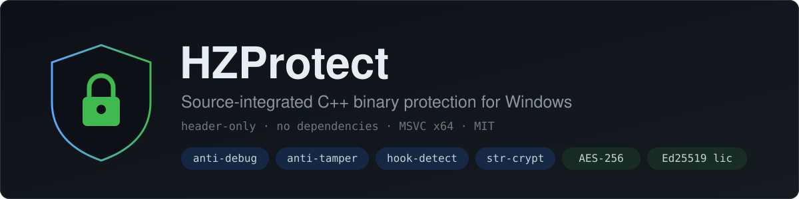
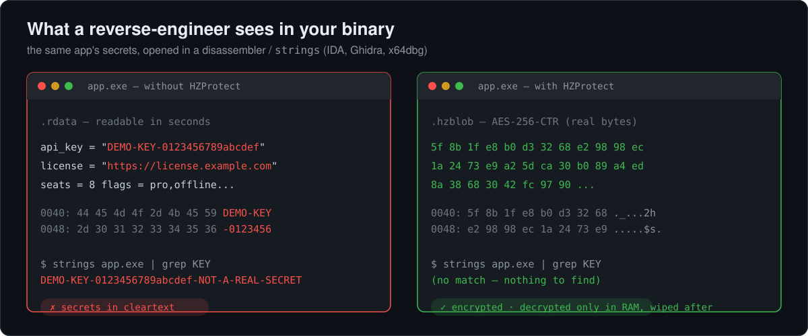
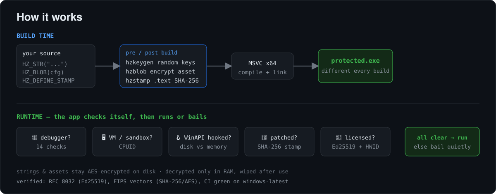

<p align="center">
  
</p>

A header-only C++ protection toolkit you compile into **your own** Windows
application to make it harder to debug, crack, and reverse-engineer. No external
dependencies — include the headers, call into them from your own code.

This is a *source-integrated* protection library (the developer builds it into
their program). It is **not** a packer or a wrapper around arbitrary binaries.

## What it does, at a glance

Your secrets never sit in the binary as readable text — they are AES-encrypted
and only decrypted in memory. The same bytes a reverse-engineer would open in
IDA, Ghidra or `strings` show nothing:

<p align="center">
  
</p>

## How it works

<p align="center">
  
</p>

## Modules

| Header | What it gives you |
|---|---|
| `hz_antidebug.h` | 14 independent debugger / analysis checks, scored into one `debugger_present()` call, plus `hide_from_debugger()` |
| `hz_antivm.h` | Hypervisor / VM detection via CPUID (present-bit + vendor string) |
| `hz_hooks.h` | Inline-hook detection: compares WinAPI prologues in memory vs the clean bytes on disk |
| `hz_ed25519.h` | Ed25519 signatures + SHA-512 (RFC 8032, validated against the official test vectors) |
| `hz_license.h` | Offline signed licenses: HWID binding, expiry, feature flags; verify with an embedded public key |
| `hz_integrity.h` | Runtime self-integrity: SHA-256 of your `.text` **on disk**, baked in by `hzstamp` and checked at startup (anti-crack) |
| `hz_strcrypt.h` | `HZ_STR("...")` — literals encrypted at compile time, decrypted on use, wiped after; never cleartext in the file |
| `hz_sha256.h` | SHA-256 + HMAC-SHA256 (no deps) |
| `hz_aes.h` | AES-256-CTR (software, no AES-NI dependency) |
| `hz_blob.h` | Embed an AES-encrypted asset; decrypt **only in memory**, wiped after use |
| `hzprotect.h` | Umbrella include |

### Tools (`src/tools/`)

| Tool | Role |
|---|---|
| `hzkeygen` | Pre-build: emits fresh random key material each build — a 64-bit seed mixed into every `HZ_STR` key and a 256-bit master key for blobs |
| `hzblob` | Encrypts an asset file with the per-build key into an embeddable header |
| `hzstamp` | Post-build: bakes the `.text` SHA-256 into the integrity stamp slot |
| `hzlicense` | Offline license authority: `keygen`, `hwid`, `issue` (HWID / expiry / features) |

## Quick start

```cpp
#include "hzprotect.h"

HZ_DEFINE_STAMP(g_stamp);   // one integrity slot; hzstamp fills it post-build

int main() {
    if (hz::debugger_present())                         // any strong debug signal
        return 0;                                       // bail quietly

    if (hz::verify_stamp(g_stamp) == hz::Integrity::Tampered)
        return 0;                                        // binary was patched -> refuse

    puts(HZ_STR("licensed build ok").c_str());          // string absent from the .exe
}
```

Build your app, then run the stamper once on the output:

```
hzstamp your_app.exe
```

`hzstamp` hashes the `.text` section and writes the digest into the stamp slot
(it locates the slot in a writable data section, never confusing it with the
magic constant in `.rdata`). At runtime `verify_stamp` recomputes the on-disk
`.text` hash and compares.

## The modules in detail

### Anti-debug (`hz_antidebug.h`)

`hz::debugger_scan()` returns a `DebugReport` with each check broken out;
`hz::debugger_present(threshold)` sums them. The 14 checks:

- `PEB.BeingDebugged`, `IsDebuggerPresent`, `CheckRemoteDebuggerPresent`
- `NtGlobalFlag` heap bits
- `NtQueryInformationProcess`: DebugPort / DebugObjectHandle / DebugFlags
- Hardware breakpoints (DR0–DR3), RDTSC timing gap
- `ThreadHideFromDebugger` set/query mismatch
- `CloseHandle` invalid-handle exception, `int3` swallowed
- `DbgUiRemoteBreakin` head byte patched
- Parent process is a known debugger (x64dbg, windbg, IDA, cdb, …)

Each is a heuristic; act on the aggregate. `hide_from_debugger()` is an active
measure that detaches the current thread from the debugger's event stream.

### Self-integrity (`hz_integrity.h`)

Hashes the raw on-disk bytes of a section of your own executable — on disk, not
memory, because ASLR base relocations make an in-memory `.text` hash unstable
across runs, while the on-disk bytes are exactly what a patcher edits. CRC32 is
available as a lightweight option; SHA-256 via the stamp is the default. Fails
closed: if the hash can't be read, it reports tampering.

### String encryption (`hz_strcrypt.h`)

`HZ_STR("literal")` XOR-encrypts the literal at compile time with a per-call-site
key (mixing `__FILE__`, `__LINE__`, `__COUNTER__`), stores only the ciphertext,
and decrypts into a stack buffer zeroed on scope exit. Two identical literals
encrypt differently. Returns a scoped object; use `.c_str()` for C APIs.

### Inline-hook detection (`hz_hooks.h`)

`hz::scan_hooks()` walks a watch list of memory/process/module WinAPIs (ntdll
`NtProtectVirtualMemory`, `NtReadVirtualMemory`, `NtWriteVirtualMemory`,
`LdrLoadDll`, … plus kernel32), and for each one compares the first bytes of the
function in memory against the clean bytes read from the owning module's file on
disk. A difference shaped like a `jmp rel32` / `jmp [rip]` / `push;ret` /
`mov rax;jmp` / `int3` is reported as a trampoline hook. Legit `jmp [rip]`
forwarders (e.g. `kernel32!VirtualProtect` → kernelbase) are *not* flagged
because their on-disk bytes match. Detection is read-only.

### Licensing (`hz_license.h` + `hzlicense`)

Offline licenses signed with Ed25519. You generate a key pair once
(`hzlicense keygen`), embed the 32-byte **public** key in your app, and keep the
private key offline. Each license is a small payload — feature bitmask, optional
machine binding (`hz::hwid()` = SHA-256 of MachineGuid + volume serial +
computer name + CPU brand), optional expiry — plus a 64-byte signature, wrapped
in base64. The app calls `hz::verify_license(text, pubkey)` and gets back
`Valid` / `BadSignature` / `WrongMachine` / `Expired` / `BadFormat`. Forging a
license needs the private key; pair it with the integrity stamp so that patching
the check out is itself detected.

```
hzlicense keygen priv.bin license_pubkey.h          # once; embed the header
hzlicense hwid                                       # a customer's machine id
hzlicense issue priv.bin --out c.key --hwid <id> --expiry 2027-01-01 --features ff
```

The Ed25519 + SHA-512 implementation is validated against the RFC 8032 test
vectors (public-key derivation, signature, and verification) in `edtest`.

### Crypto (`hz_sha256.h`, `hz_aes.h`)

Standalone SHA-256 / HMAC-SHA256 and AES-256-CTR, both header-only with no
dependencies, validated against FIPS test vectors in the demo.

### Per-build randomization (`hzkeygen`)

Run `hzkeygen` before each build to emit `hz_build_keys.h` (a 64-bit
`HZ_BUILD_SEED` + a 256-bit `HZ_BUILD_MASTER_KEY`) with fresh random values. The
seed is folded into every `HZ_STR` compile-time key, so **the same source and
the same asset encrypt to different bytes in every build** — cross-version
diffing and static signatures on your protected strings/assets break, while each
shipped binary stays byte-stable (the integrity stamp still works). The
generated key files are git-ignored and must not be committed.

### In-memory assets (`hz_blob.h` + `hzblob`)

`hzblob asset.json out.h name key.bin` encrypts an asset with AES-256-CTR (the
per-build master key + a random nonce) into an embeddable header. At runtime:

```cpp
#include "config_blob.h"
hz::ScopedBytes cfg = HZ_BLOB(config_blob).decrypt();  // plaintext only in RAM
use(cfg.c_str());
// cfg is zeroed and freed here — plaintext never touches disk
```

The ciphertext is what sits in the binary; the plaintext exists only in a
heap buffer that is wiped on scope exit.

## Build

MSVC x64 (Visual Studio 2022). Either:

```
build.bat                 REM tools -> per-build keys -> encrypt asset -> build + stamp demo
```

or CMake:

```
cmake -B build -A x64
cmake --build build --config Release    REM auto-stamps hzdemo post-build
ctest --test-dir build -C Release
```

`hzdemo` exercises every module and prints a report. Run it normally, then under
a debugger to watch the anti-debug score climb.

## Verified (CI, `windows-latest`)

- SHA-256 and AES-256 self-tests pass against FIPS vectors.
- Encrypted literals **and** the embedded asset (api_key, license server) do **not**
  appear in the binary; the asset decrypts correctly in memory at runtime.
- Every build produces a different seed and different asset ciphertext from the
  same source.
- A single-byte on-disk patch to `.text` is detected (`verify_stamp() = TAMPERED`).
- Ed25519 matches the RFC 8032 known-answer vectors; licenses verify as
  Valid / BadSignature / WrongMachine / Expired across all cases.
- Inline-hook scan reports 0 hooks on a clean process (10/10 prologues match
  disk) and the classifier recognizes every trampoline shape.
- Locally under `cdb`, the anti-debug score reaches 8/14 and `debugger_present()` returns true.

## Scope / limits

These are deterrents, not guarantees — a determined analyst with a kernel
debugger or an emulator can defeat any usermode check, and a self-integrity hash
whose logic is in the same binary can be re-stamped by whoever cracks it. The
goal is to raise the cost of casual cracking and static analysis of your own
software.

## License

MIT
